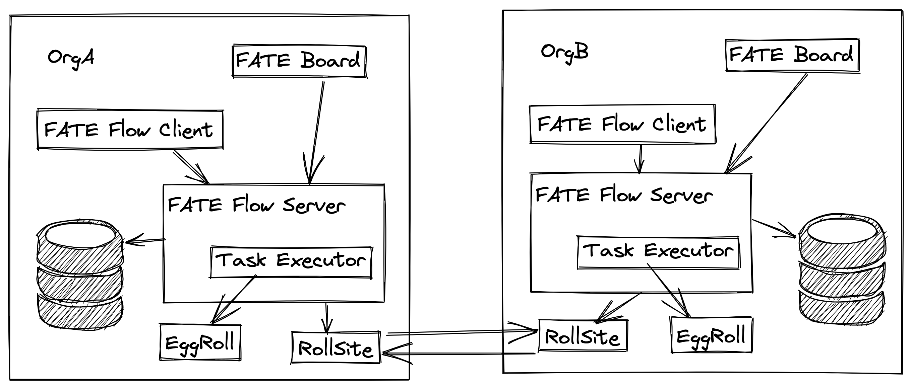
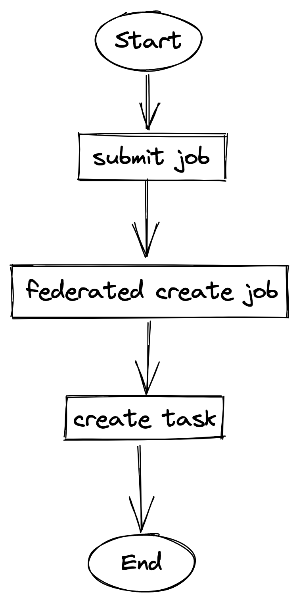
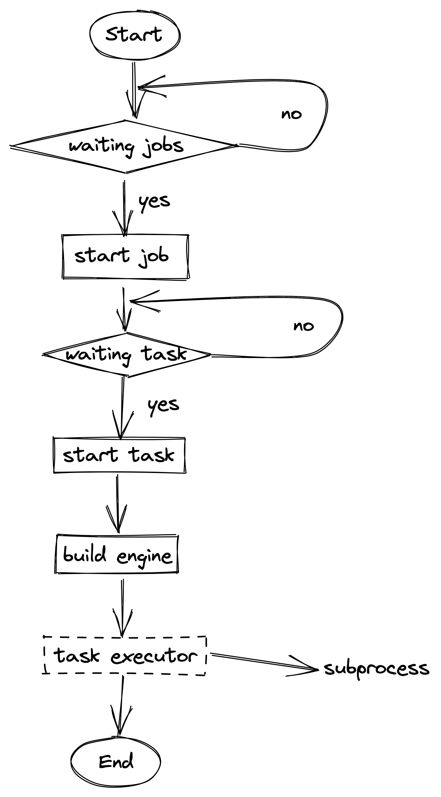

- 基于 [FATE-FLow (b53f47ab3e)](https://github.com/FederatedAI/FATE-Flow/tree/b53f47ab3e) 分支进行分析。
- 
- 从上图可以看出 FATE-Flow 分为两个部分。
	- FATE Flow Server：主要负责内部数据处理任务分配调用以及调用其他成员的 API。
		- Task Executor：用来启动一个 Task 的线程。
	- FATE Flow Client：一个 Cli 工具主要负责调用 FATE Flow Server。
- FATE Flow 源码结构。
	- ```bash
	  python/fate_flow
	  ├── apps                              # FATE Flow Server API 接口定义
	  ├── component_env_utils
	  ├── components
	  ├── controller
	  │   ├── engine_controller
	  ├── db
	  ├── detection
	  ├── entity
	  ├── errors
	  ├── manager
	  ├── model
	  ├── operation
	  ├── pipelined_model
	  │   └── homo_model_deployer
	  │       └── kfserving
	  │           └── model_storage
	  ├── protobuf
	  ├── scheduler
	  ├── scheduling_apps                   # 调用合作方的 API 接口定义
	  │   └── client
	  ├── tools
	  ├── utils
	  └── worker
	  ```
- ## 任务的发起
- 涉及到有关模块以及类：
	- apps/job_app.py：Job 接口定义模块（对内）
	- DAGScheduler(Cron)：Job 调度类
	- FederatedScheduler(object)：多方任务调度类（对外）
	- scheduling_apps/party_app.py：对外调度接口模块
	- JobController(object)：Job 控制模块 （CRUD）
	- WorkerManager：主要用于管理 Task 的子进程模块
	- TaskInitializer(BaseWorker)：初始化 Task
	- TaskController(object)： Task 控制模块（CRUD）
-
- 流程图：
	- {:height 587, :width 288}
- 函数调用链：FATE Flow Client（FFC），FATE Flow Server（FFS）
	- apps/job_app.submit_job.sumbit_job：FFC 发起提交任务。
		- scheduler/dag_scheduler.submit：FFS 发起提交任务至多方。
			- scheduler/federated_scheduler.create_job：FFS 调用参与方的 create job 接口。
	- controller/job_controller/create_job：FFS 调用 federated scheduler 后进入的接口。
		- manager/worker_manager.start_general_worker
			- worker/task_initializer.run
				- controller/task_controller.create_task 最终 FFS 会创建 task。
- ## 任务的执行
- 涉及到有关模块以及类：
	- DAGScheduler(Cron)：Job 调度类
	- scheduling_apps/party_app.py：对外调度接口模块
	- JobController(object)：Job 控制类
	- TaskScheduler(object)：Task 调度类
	- FederatedScheduler(object)：多方任务调度类（对外）
	- TaskController(object)：Task 控制类
	- controller/engine_adapt.py：Engine 适配模块（EggRoll， Spark）
	- EggrollEngine(EngineABC)：EggRollEngine 类
	- WorkerManager：初始化 Task
	- worker/task_executor.py：Task 执行脚本
- 流程图：
	- {:height 617, :width 341}
- 函数调用链：
	- scheduler/dag_scheduler.run_do
		- scheduler/dag_scheduler.schedule_waiting_jobs
			- scheduling_apps/party_app.start_job
				- controller/job_controller.start_job
					- scheduler/task_scheduler.schedule
						- scheduler/task_scheduler.start_task
							- controller/task_controller.start_task
								- controller/engine_adapt.build_engine
									- controller/engine_controller/eggroll.run
										- worker/task_executor.run